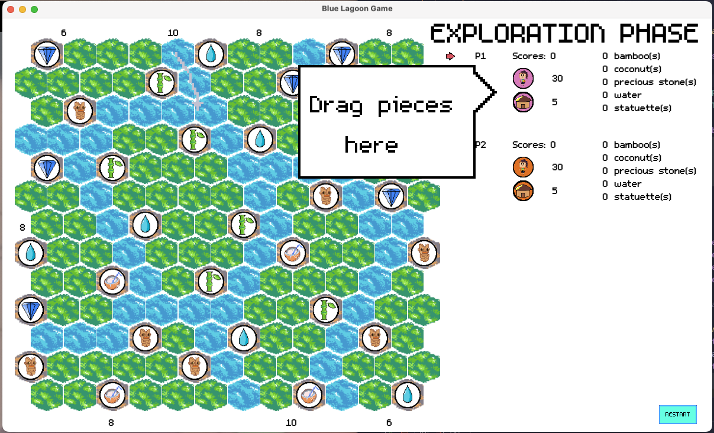

# Java homework of the first semester: Board Game Blue Lagoon

Based on JavaFX.

All images drawn by myself using Aseprite.

Fonts used: [Field Guide Font by rare](https://rarelikeaunicorn.itch.io/field-guide)，[Gravity Pixel Font by John Watson](https://jotson.itch.io/gravity-pixel-font) and [m5x7 Font by Daniel Linssen](https://managore.itch.io/m5x7)

Rule book: [Rule book](assets/rules/rulebook.pdf)

Chinese readme: [Chinese translation](Chinese.md)

# Screenshots
Home page:

Game page:
